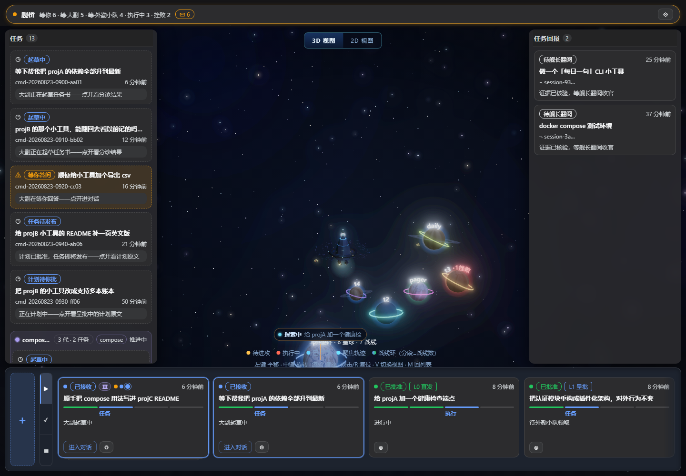
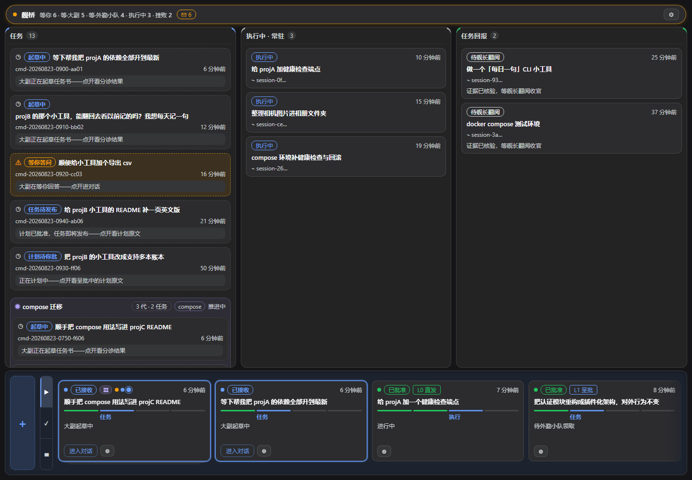
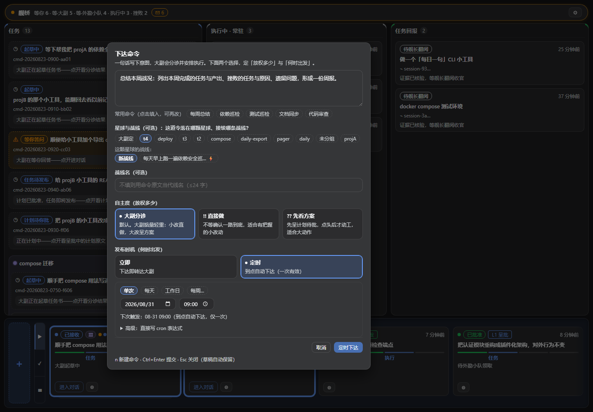
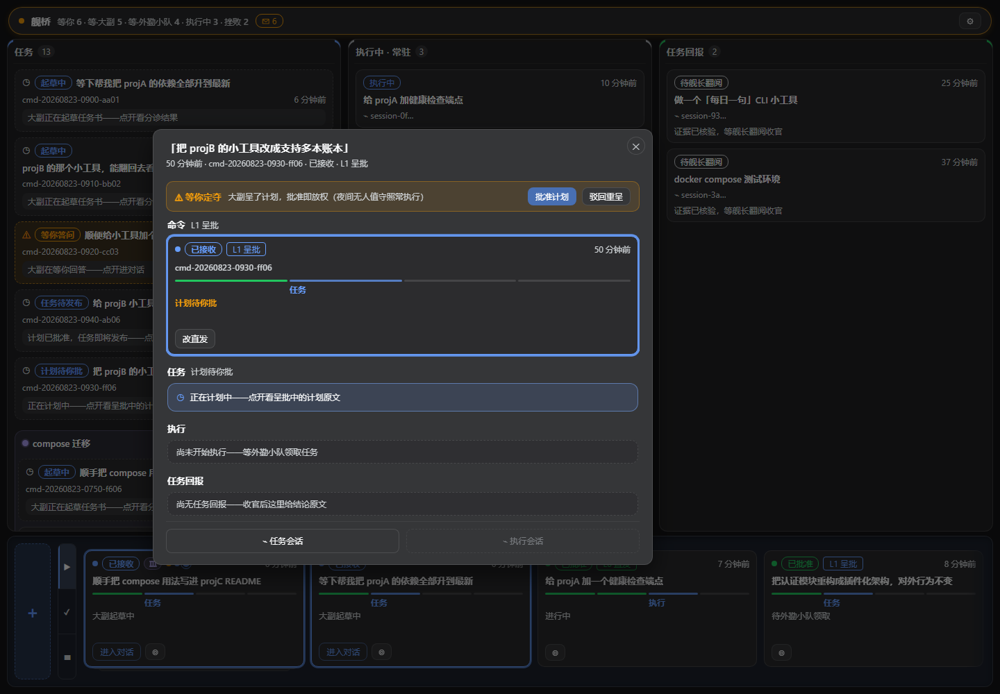

<div align="center">

# ⬡ 作战室 · dsh-plugin-warroom

**把「和 agent 聊天」变成「向舰队下达命令」。**

一个 RTS 星际战舰风格的多 agent 编排看板，为 [DeepSeek Harness](https://github.com/deepseek-ai)（dsh）打造。
你是舰长：下大白话命令，大副拆解成带验收标准的任务书，外勤小队在各星球（工作区）自主作战——
而你，只需要在想起来的时候回舰桥看一眼。

[](LICENSE)
[](https://nodejs.org)
[](#安装--开发)



*3D 星域：每颗星球 = 一个真实工作区，环 = 战线，蓝环脉冲 = 正在执行，飞着的信标 = 外勤小队*

</div>

---

## 为什么做这个

这个项目起源于一个所有 AI agent 用户都有的不满：**侧栏**。

现在的 agent 侧栏都在管理两样东西——项目文件夹和会话列表。用久了必然遇到：

- 会话多到一定程度，**找不到想回的那个会话**；
- 好容易回去了，**想不起来当初让它干什么**，得往回翻聊天记录找命令；
- 一个会话里常常干过**好几种事**，不是「一个会话只做一件事」，记录乱成一团。

于是我意识到：用 agent 的本质动作其实特别简单——**输入命令 → agent 执行 → 输入命令 → agent 执行**。
那为什么不直接**以命令为切入点**？找到当时下达的那道命令，知道我让 agent 做了什么，
就能一路追溯到 agent 在哪里、完成了什么、死在了哪一步。

再往前一步：这不像在用工具，**像在当星际迷航的舰长**——舰长下达命令，大副和舰队成员
去各个星球执行。于是有了这个新的 agent 使用范式：

> **不再是单纯的对话，而是下达一道道命令。**

它带来三个直接的好处：

1. **混乱的 session 被收编了。** 会话不再是管理的单位，命令才是。会话自动挂进由命令索引的
   **战线**，从任何一张卡都能溯源到「我当初说了什么」。
2. **你真的可以挂机了。** 大副会分诊、呈计划、派兵、验收；全绿自动收官。你不必盯屏幕，
   每次回到屏幕前，像舰长巡视一样一次性处理多条战线的事宜。
3. **它变有趣了。** 这很重要。

## 它长什么样

### 舰桥：一条命令的一生，一眼看完



- **灵动岛**收编全部操作件与计数：收件箱（等你定夺的事）、到访摘要（你离开时发生了什么）；
- **三列局势墙**：任务（大副侧台账）→ 执行中（实时动词活动行）→ 任务回报（等你翻阅收官）；
- **底部命令调度条**：全部命令卡横滚，每张卡一条四段生命条（命令→任务→执行→战报）；
- 卡片按**战线分组**、链色随战线——多代续接的战线一眼成串。

### 下达命令：像定闹钟一样简单



- **常用命令模板**：每周总结 / 依赖巡检 / 测试巡检 / 文档同步 / 代码审查，点击即填；
- **星球与战线一个控件**：先选星球（大副决定或指定工作区），再选接续哪条战线或新开——
  续接必随该星球的战线，结构上不可能选错；
- **闹钟式定时**：单次 / 每天 / 工作日 / 每周…，下次触发时间实时预览，cron 只留给想写的人；
- **三档自主度**：`!! 直接做`（L0 全自动）/ 大副分诊（默认，L1 计划呈批）/ `?? 先看方案`（L2 对话收敛）。

### 一条命令的聚焦页：追溯的终点



点任何一张卡，进入这条命令的四段故事线：命令 → 任务 → 执行 → 任务回报。
计划呈批时，顶部常驻**「等你定夺」决策带**——批准即放权，驳回即重谈，
一键保留后果说明。半夜呈批的计划会明说「夜间无人值守照常执行」。

### 星域：舰队在真实工作区上作战

顶部大图即星域。星球 = 真实工作区（或在沙盒里新建），颜色环 = 战线归属，
状态一望可知（蓝 = 机器在动 / 琥珀 = 等你 / 绿 = 善终 / 红 = 败），
外勤小队编队在星球间飞行执行任务。深空与天空双主题，浅色模式是完整的另一套美术
（浮空岛 + 天空旗舰 + 状态色环垫），不是简单反色。

## 核心概念

| 概念 | 是什么 |
|---|---|
| **命令** | 你下达的一句话。板是一台读投影：账本里有的不隐藏，没有的不显示。 |
| **战线** | 命令的聚合。多代续接（深化/重试/转向）成一条战线，绑一颗星球，链色标识。 |
| **星球** | 真实工作区。星域是它们的地图；HQ 点击可把宿主已有工作区注册为星球。 |
| **大副** | 你的贴身参谋会话：分诊每道命令、起草任务书、验收、呈批计划。 |
| **外勤小队** | 按兵种（侦察/工程/卫生/宣传…TOML 可扩编）编成的子代理部队，在隔离工作区执行。 |
| **KillCredit** | 机械收官判据：提交全绿自动验收，失败留败因一票否决。 |

## 快速开始

```bash
# 安装（dsh 内）
dsh plugin add dsh-plugin-warroom          # npm（发布后）
dsh plugin add ./dsh-plugin-warroom-0.1.0.tgz

# 从源码跑（在 deepseek-harness checkout 内）
git clone https://github.com/Kaiji-Z/dsh-plugin-warroom
cd dsh-plugin-warroom && pnpm install && pnpm verify
pnpm dsh --profile web --patch <本仓库路径>/cordis.dev.yml --port 3080 --no-open
```

打开 web 端，侧边栏点「舰桥」，`＋` 下达第一道命令——或者按 `n`。

**数据与恢复**：一切状态落在 append-only JSONL 账本（战役/命令/挂载三条流），
状态由 fold 派生——崩溃可恢复，战后可复盘，历史永不丢。

> Windows 本地开发：`pnpm add file:` 装不进 profile 时用 junction（`mklink /J`）绕过；
> patch 旗标必须 `dsh --profile web --patch ...` 连写。

## 机器检查的信任

不靠「我觉得能跑」：`pnpm verify` 三段式（单元/回归测试 + 构建 + bundle 针脚断言）
每次提交全绿；`verify:eval` LLM 监督层（三维评分 + 越界一票否决）；`verify:e2e`
真实 LLM 两代续接链实弹门。UI 侧有全套 Playwright 取证脚本（`scripts/shoot-*.py`），
对比度、键盘可达、双主题均有机检。协议见 [VERIFICATION.md](VERIFICATION.md)。

## 文档

| 文档 | 内容 |
|---|---|
| [DESIGN.md](DESIGN.md) | 实现决策录：每个版本为什么这么做（改 UI 前必读） |
| [AGENTS.md](AGENTS.md) | 给 AI 迭代 agent 的开局指引与坑录 |
| [VERIFICATION.md](VERIFICATION.md) | 验证协议正本 |

## 版本史

| 版本 | 一句话 | 验收 |
|---|---|---|
| v1.0 悬赏令 | 参谋起草 / KillCredit / 失败自愈 / cron / SSE | c67e74e |
| v2.0 五分区悬赏板 | 命令区生命周期 / 多指挥官并行 / 履历档案 / `@new:` | 2026-08-24 |
| v3 两区指挥中心 | 每命令一参谋会话 / 纯跳转判定 / 挂载外部会话 | 真实 LLM 八步考题 |
| v4 指挥部队内协作 | 部队级模型路由 / 队内邮箱 / 任务图调度 / park 换手 | 机检 6/6 |
| v5 参谋自动化（AFK） | 三档自主度 / 计划呈批 / goal 代管 / 全绿自动收官 / 配额熔断 | assert-v5 PASS |
| V6 增量 | 计划判定回推 / 双皮肤 / 命令拆链 / 三区看板+全生命周期 | 877f197 |
| V7 到访式工作流 | 收件箱 / 到访摘要 / 族系悬停+聚焦 / 夜间预检 / 空板引导 | 160 测+shoot |
| V8 hero 灵动岛 | 胶囊岛收编操作件 / 三区视觉大容器 / 悬停自动滚动 | b121d52 |
| V9 命令调度中心 | 三级布局 / 命令卡唯一详情入口 / 战报合并时间序 | 36e1eea |
| V9.2-V9.10 | 定时命令闭环 / a11y 整改 / 容器化美化 / 聚焦页 / 12 态状态机 | 各轮 verify+shoot |
| V9.11-V9.13 | 任务列台账 / 实时活动行 / 语义令牌双主题色彩系统 | 203 测 + theme 20/20 |
| V10-V11.5 | 续接三模式 / 3D 星域战场 → 真实板数据驱动 | probe-bridge 14/14 |
| V12-V12.2 | 浅色天空范式 → 语义 token 化全项目重铸 | 228 测 + theme 20/20 |
| **V13-V14 战线范式** | **战线=血脉∩战场，战场⊃战线⊃命令** / 本地计代 / 溯源 chip | 239 测 + 七针脚 |
| **V15 续接闭环** | 链档案三档注入 / workspaceKind 投影 / 战线命名 | verify+六针脚+五 shooter |
| **V16 星际迷航语义** | **舰长—大副—外勤小队**，全套词表随皮肤派生 | 三皮肤实测全绿 |
| V17 页签+归档+管网 | 三页签切片 / 命令归档 / 族系管网随战况生长 | verify + shoot-v17 |
| **V18 星域重铸+起草器重铸** | 星球=真实工作区 / 弧形铭文 / 天空旗舰 / 融合选择器+闹钟定时 | verify + probe/shoot 全绿 |

**后续候选**：npm 正式发布、路由冷恢复桥、调度轮转优化、飞书遥控、worktree 隔离、战绩/声望、多参谋。

## License

[MIT](LICENSE)
